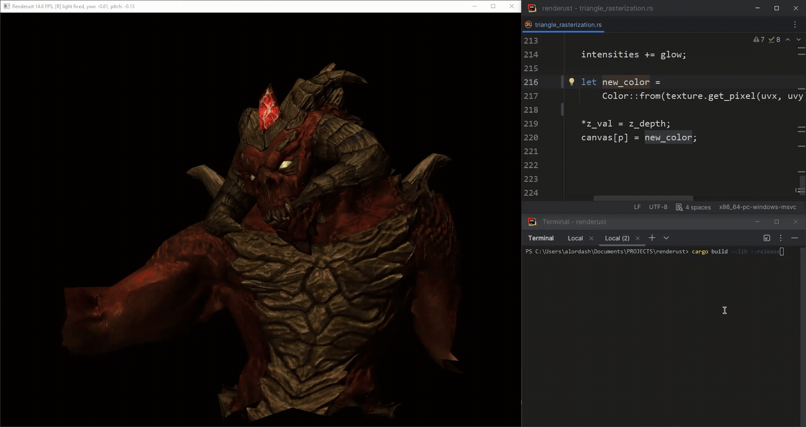

# already (⚠ WIP)

Library for hotreload in Rust. Hotreload allows you to change your code without restarting application.

Though you can use it in `--release` build, it's primarily intended to speed-up development process and shouldn't be
used in production.

Usage with [software renderer](https://github.com/alordash/renderust):  


Usage with [bevy example](https://bevy.org/examples/2d-rendering/move-sprite/):  


## Simple usage (slower)

Your crate must be `lib` crate. You can have separate binaries in it though.  
Steps to use this library:

1. Add `already` to `Cargo.toml` dependencies:

```toml
[dependencies]
already = "*"
```

2. Add `crate-type = ["cdylib", "lib"]` to `lib` section in `Cargo.toml` (your crate must produce dynamic library):

```toml
[lib]
crate-type = ["cdylib", "lib"]
```

3. Label function you want to make hotreloadable with `#[hotreload]` attribute:

```rust
use already::hotreload;

#[hotreload]
fn add(a: i32, b: i32) -> i32 {
    a + b
}
```

Run your binary application, change `add` function and then try to rebuild it without stopping running application. You
should see that `add` now returns different value!

### Downside (why slower)

This approach makes it so that each call to function labeled with `#[hotreload]` actually loads your dynamic library,
searches this method there, calls it and unloads library, which is of course very slow.

But there is faster approach! We don't need to load/unload dynamic library with each call, we can keep it in memory and
reload only when new version is available. Next section tells how to utilize this approach.

## `runtime` feature usage (faster)

This approach is only more complicated in that it requires more to do in one time setup. After you've completed set up
you'll only need to add `#[hotreload(runtime)]` to your functions just like in simple approach.

Your crate must be `lib` crate. You can have separate binaries in it though.  
This approach also uses [build script](https://doc.rust-lang.org/cargo/reference/build-scripts.html) (later on that).  
Steps to use this library:

1. Add `already` with `runtime` feature to `Cargo.toml` dependencies and build dependencies:

```toml
[dependencies]
already = { version = "*", features = ["runtime"] }

[build-dependencies]
already = { version = "*", features = ["runtime"] }
```

2. Add `crate-type = ["cdylib", "lib"]` to `lib` section in `Cargo.toml` (your crate must produce dynamic library):

```toml
[lib]
crate-type = ["cdylib", "lib"]
```

3. Add `already::runtime::build()` to your build script (the `build.rs` file in the root of your crate). This
   function
   parses your code and generates dynamic library wrapper structures that hold pointers to hotreloadable functions.

```rust
// build.rs
fn main() {
    already::runtime::build();
}
```

4. Add `already::runtime::add_runtime!();` anywhere in your crate's root (presumably in `lib.rs` file, if you're not
   sure see [examples](examples)).

5. Add `already::runtime::start_watchers!(your_crate_name)` somewhere in your binary's `main` function. This spawns
   watcher
   that looks after your dynamic library file and reloads dynamic library when it changes. `your_crate_name` is either
   `package.name` from `Cargo.toml` or just `crate` if your binary is located in the same place as your library's code.

```rust
// bin.rs
fn main() {
    already::runtime::start_watchers!(your_crate_name);
    // your code
}
```

6. Label function you want to make hotreloadable with `#[hotreload(runtime)]` attribute:

```rust
use already::hotreload;

#[hotreload(runtime)]
fn add(a: i32, b: i32) -> i32 {
    a + b
}
```

Run your binary application, change `add` function and then try to rebuild it without stopping. You should see that
`add` now returns different value!

## Examples

You can see usage examples in [examples](examples) directory.

## Limitations

See [LIMITATIONS.md](LIMITATIONS.md) (yes, unfortunately there are enough of them for justifying creation of separate
file, but their number could be reduced in future).

## Benchmarks

Benchmarks are located in [benchmarks](benchmarks) folder. You can run them to see the execution time of no hotreload,
simple hotreload and runtime hotreload invocation of same function that calculates Fibonacci numbers.

Here is random sample of benchmark results from my PC (i7-14700HX):

```
no hotreload fibonacci time:        [16.245 ns 16.348 ns 16.469 ns]

simple hotreload fibonacci time:    [95.439 µs 96.832 µs 98.403 µs]

runtime hotreload fibonacci time:   [19.498 ns 19.692 ns 19.917 ns]
```

#### // TODO

- [ ] write about `already::runtime::build` for tests and separate directories
